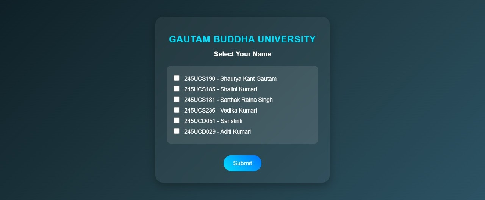

# QR Attendance System

A web-based attendance system that allows students to mark attendance by scanning a QR code. The system records attendance along with location and timestamp data for basic verification.

## Features

* QR Code Based Attendance
* GPS Location Verification
* Attendance Timestamp Recording
* Student Attendance Tracking
* SQLite Database Storage
* Responsive Interface

## Tech Stack

* React
* TypeScript
* Tailwind CSS
* Flask
* SQLite

## How to Run

### Frontend

```bash
npm install
npm run dev
```

### Backend

```bash
cd backend

pip install flask flask-cors

python app.py
```

## Screenshots

### Admin Page


### Student Page


